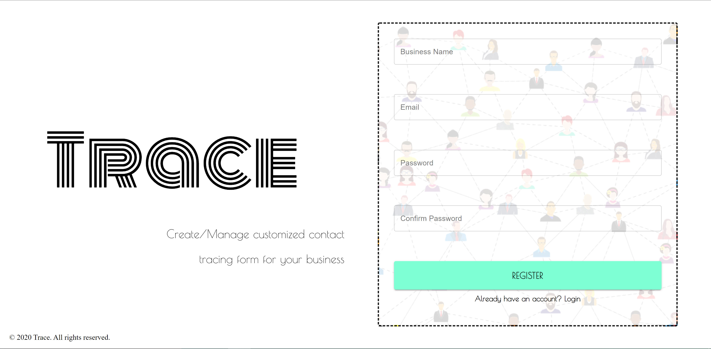
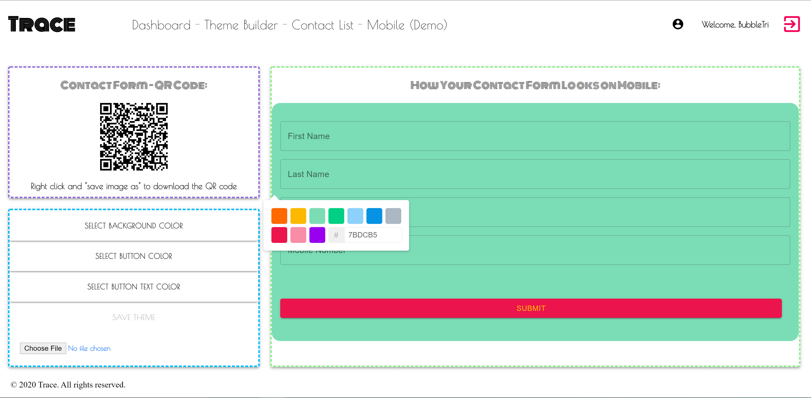

# ProjectThree

## Application & Repository Link

###### [Application Link](https://dashboard.heroku.com/apps/protected-fortress-90500)

###### [Repository Link](https://github.com/Suji-GitH/MBC-ProjectThree)

## Content

- [Overview](#Overview)
- [Acceptance Criteria](#Acceptance-Criteria)
- [Application Screens](#Application-Screens)
- [Installation](#Installation)
- [Credits](#Credits)
- [Future Development](#Future-Development)
- [Testing](#Testing)

## Overview

```
Final Project for full stack full-stack web developer Boot Camp course.
```

## Acceptance Criteria

- Must use ReactJS in some way
- Must use a Node and Express Web Server
- Must be backed by MongoDB database with Mongoose ORM
- Must have both GET and POST routes for retrieving and adding new data
- Must deploy this application using Heroku with data.
- Must utilize at least 2 new libraries, packages, or technologies
- Must allow for or involve the authentication of users in some way
- Must have a polished front end/UI
- Must have a folder structure that meets the MVC paradigm
- Must meet good quality coding standards (indentation, scoping, naming)
- Must protect API keys in Node with environment variables

## Installation

1. Download/Clone this GitHub repository.
2. Install dependencies via npm i.
3. Run the app through node.js by npm start.

## Application-Screens

###### App Screenshots

Authentication Page



Dashboard


Theme Builder




Customer List


Contact Tracing Form


## Credits

- Heroku
- MERN
- Material Ui
- Victory
- React Color
- TippyJs
- Passport
- qrcode.react

## Future Development

Business Portal:

- Complex Chats
- Mobile Responsive
- Meet Dhhs Compliance
- Further Customisation for the user application
- UX for handing errors and validations

Customer Facing Application:

- Convert to Mobile App
- Add multiple users
- Pay Feature
- Review Feature

## Testing

Testing was conducted manually and tested against the user stories. **_Test Cases will be added in the future_**
